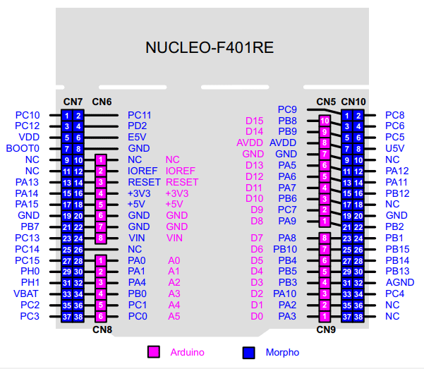

# STM32-codes

## Pin Out

## Tutorials
- [Read MPU6050 with I2C](https://electronics.stackexchange.com/questions/601062/read-mpu6050-over-i2c-with-stm32-nucleo-board)
- [Read MPU6050 with I2C and show display](https://www.youtube.com/watch?v=xxphp9wDnHA)
